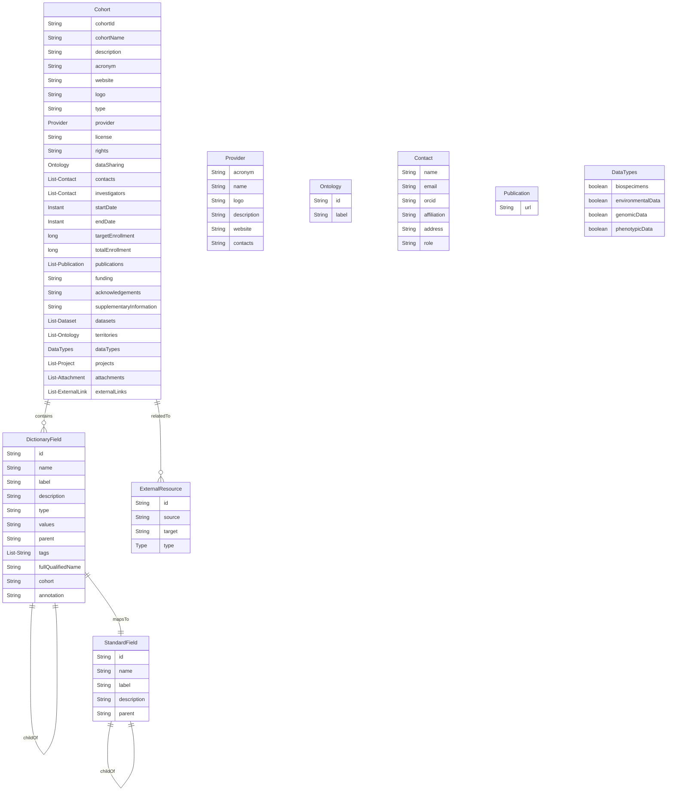

## Entity Relationships

This is the low level representation of cohort and associated entities. The structure is volatile at the moment. 

```mermaid
erDiagram
    Cohort {
        String cohortId
        String cohortName
        String description
        String acronym
        String website
        String logo
        String type
        Provider provider
        String license
        String rights
        Ontology dataSharing
        List-Contact contacts
        List-Contact investigators
        Instant startDate
        Instant endDate
        long targetEnrollment
        long totalEnrollment
        List-Publication publications
        String funding
        String acknowledgements
        String supplementaryInformation
        List-Dataset datasets
        List-Ontology territories
        DataTypes dataTypes
        List-Project projects
        List-Attachment attachments
        List-ExternalLink externalLinks
    }
    
    Provider {
        String acronym
        String name
        String logo
        String description
        String website
        String contacts
    }
    
    Ontology {
        String id
        String label
    }
    
    Contact {
        String name
        String email
        String orcid
        String affiliation
        String address
        String role
    }
    
    Publication {
        String url
    }
    
    DataTypes {    
        boolean biospecimens
        boolean environmentalData
        boolean genomicData
        boolean phenotypicData
    }
    
    DictionaryField {
        String id
        String name
        String label
        String description
        String type
        String values
        String parent
        List-String tags
        String fullQualifiedName
        String cohort
        String annotation
    }
    
    StandardField {
        String id
        String name
        String label
        String description
        String parent
    }
    
    ExternalResource {
        String id
        String source
        String target
        Type type
    }
    
    Cohort ||--o{ DictionaryField : contains
    Cohort ||--o{ ExternalResource : relatedTo

    DictionaryField ||--|| DictionaryField : childOf
    DictionaryField ||--|| StandardField : mapsTo
    StandardField ||--|| StandardField : childOf
```