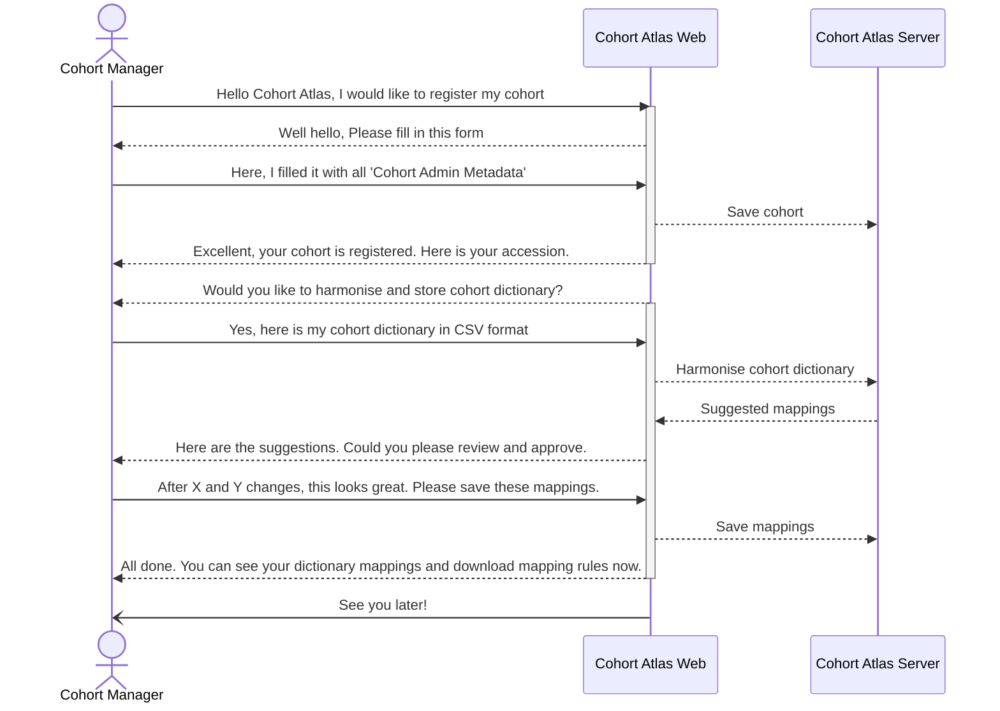
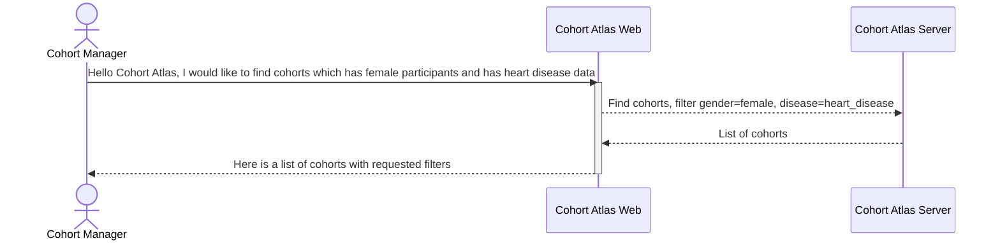
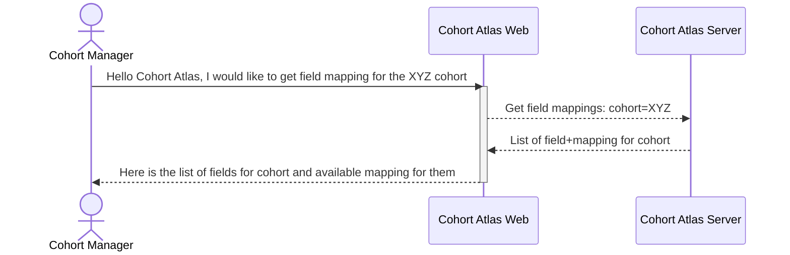

# Use Cases
1. Cohort registration
2. Search for cohorts matching criteria
3. Export cohort dictionary mappings

## Cohort Registration

```mermaid
sequenceDiagram
    actor Cohort Manager
    participant Cohort Atlas Web
    participant Cohort Atlas Server
    
    Cohort Manager->>Cohort Atlas Web: Hello Cohort Atlas, I would like to register my cohort
    Activate Cohort Atlas Web
    Cohort Atlas Web-->>Cohort Manager: Well hello, Please fill in this form
    Cohort Manager->>Cohort Atlas Web: Here, I filled it with all 'Cohort Admin Metadata'
    Cohort Atlas Web-->>Cohort Atlas Server: Save cohort
    Cohort Atlas Web-->>Cohort Manager: Excellent, your cohort is registered. Here is your accession.
    Deactivate Cohort Atlas Web
    
   
    
    Cohort Atlas Web-->>Cohort Manager: Would you like to harmonise and store cohort dictionary?
    Activate Cohort Atlas Web
    Cohort Manager->>Cohort Atlas Web: Yes, here is my cohort dictionary in CSV format
    
    Cohort Atlas Web-->>Cohort Atlas Server: Harmonise cohort dictionary 
    Cohort Atlas Server-->>Cohort Atlas Web: Suggested mappings
    
    Cohort Atlas Web-->>Cohort Manager: Here are the suggestions. Could you please review and approve.
    Cohort Manager->>Cohort Atlas Web: After X and Y changes, this looks great. Please save these mappings.
    Cohort Atlas Web-->>Cohort Atlas Server: Save mappings
    Cohort Atlas Web-->>Cohort Manager: All done. You can see your dictionary mappings and download mapping rules now.
    Deactivate Cohort Atlas Web
    
    Cohort Atlas Web-)Cohort Manager: See you later!
```

## Search Cohorts

```mermaid
sequenceDiagram

    actor Cohort Manager
    participant Cohort Atlas Web
    participant Cohort Atlas Server
    
    Cohort Manager->>Cohort Atlas Web: Hello Cohort Atlas, I would like to find cohorts which has female participants and has heart disease data
    Activate Cohort Atlas Web
    Cohort Atlas Web-->>Cohort Atlas Server: Find cohorts, filter gender=female, disease=heart_disease
    Cohort Atlas Server-->>Cohort Atlas Web: List of cohorts
    Cohort Atlas Web-->>Cohort Manager: Here is a list of cohorts with requested filters
    Deactivate Cohort Atlas Web
```

## Export Dictionary Mappings

```mermaid
sequenceDiagram

    actor Cohort Manager
    participant Cohort Atlas Web
    participant Cohort Atlas Server
    
    Cohort Manager->>Cohort Atlas Web: Hello Cohort Atlas, I would like to get field mapping for the XYZ cohort
    Activate Cohort Atlas Web
    Cohort Atlas Web-->>Cohort Atlas Server: Get field mappings: cohort=XYZ
    Cohort Atlas Server-->>Cohort Atlas Web: List of field+mapping for cohort
    Cohort Atlas Web-->>Cohort Manager: Here is the list of fields for cohort and available mapping for them
    Deactivate Cohort Atlas Web
```